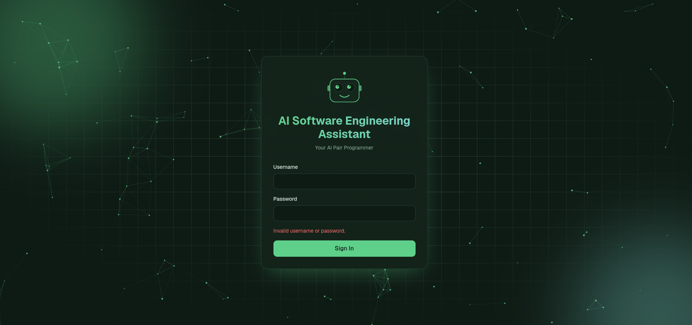

# 🤖 AI Software Engineering Assistant

<p align="center">
An AI-powered platform for understanding, analyzing, and managing software projects.
</p>

<p align="center">


</p>

<p align="center">

</p>

---

## Overview

AI Software Engineering Assistant is a modern backend platform that combines **FastAPI** with **Large Language Models (LLMs)** to help developers understand, analyze, document, and manage software projects.

Using AI function calling and a secure tool system, the assistant can inspect project files, execute development tasks, and answer questions using the actual project rather than general model knowledge alone.

---

## ✨ Features

* 🔐 JWT Authentication
* 📁 Project Management
* 🤖 AI Chat
* 🛠️ Tool-Based AI Architecture
* 📄 Project File Management
* 🏗️ Clean Layered Architecture
* 📚 Comprehensive Documentation

---

## 🏛️ Architecture

```text
                React Frontend (Planned)
                         │
                         ▼
                 FastAPI Backend
                         │
          ┌──────────────┴──────────────┐
          ▼                             ▼
     REST API                     AI Agent
          │                             │
          ▼                             ▼
     Services                    Tool Registry
          │                             │
          ▼                             ▼
   Repositories                 Project Tools
          │
          ▼
      SQLAlchemy ORM
          │
          ▼
         SQLite
```

A detailed explanation is available in **`docs/architecture.md`**.

---

## 🚀 Quick Start

Clone the repository:

```bash
git clone https://github.com/webTech75/ai-software-engineering-assistant.git

cd ai-software-engineering-assistant/backend
```

Create a virtual environment:

```bash
python -m venv .venv
```

Linux/macOS

```bash
source .venv/bin/activate
```

Windows

```powershell
.venv\Scripts\activate
```

Install dependencies:

```bash
pip install -r requirements.txt
```

Run database migrations:

```bash
alembic upgrade head
```

Start the development server:

```bash
uvicorn app.main:app --reload
```

Open Swagger UI:

```
http://localhost:8000/docs
```

---

## 📚 Documentation

Detailed documentation is available in the **`docs/`** directory.

| Document          | Description         |
| ----------------- | ------------------- |
| `architecture.md` | System architecture |
| `ai-agent.md`     | AI agent workflow   |
| `tools.md`        | AI tool system      |
| `api.md`          | REST API reference  |
| `development.md`  | Development guide   |
| `roadmap.md`      | Future plans        |

---

## 🚧 Current Status

### ✅ Completed

* User authentication
* Project CRUD
* AI chat endpoint
* Tool registry
* Project file tools
* Modular backend architecture

### 🚀 In Progress

* Project upload
* Project indexing
* Project search
* Modern React frontend

See **`docs/roadmap.md`** for the complete development roadmap.

---

## 🗂️ Project Structure

```text
backend/

├── alembic/
├── app/
│   ├── ai/
│   ├── agent/
│   ├── api/
│   ├── core/
│   ├── db/
│   ├── models/
│   ├── repositories/
│   ├── schemas/
│   ├── services/
│   └── main.py
│
├── docs/
│
├── requirements.txt
│
└── README.md
```

---

## 🌟 Vision

The long-term goal is to build an AI-powered software engineering platform capable of:

* Understanding complete codebases
* Conversational project exploration
* AI-assisted documentation
* Code review and bug detection
* Refactoring assistance
* UML generation
* Git integration
* Intelligent project search
* Developer workflow automation

---

## 🤝 Contributing

Contributions, suggestions, and feedback are welcome.

Please review the documentation in the **`docs/`** directory before contributing.

---

## 📄 License

This project is licensed under the MIT License.

---

<p align="center">
Built with ❤️ using Python, FastAPI, and Large Language Models.
</p>
